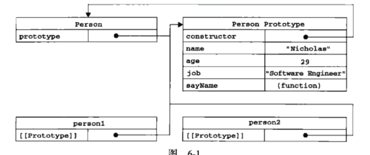
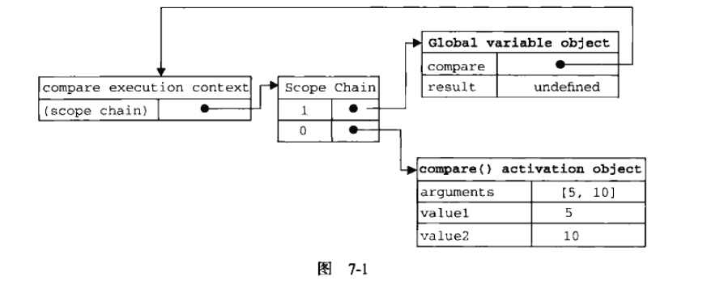

# 红宝书简单的笔记


## 第二章

`<script>`

defer延迟脚本执行


## 第四章

### 变量

基本数据类型的复制是值的复制，也就是创建毫不关联的新副本
**引用类型的复制是指针的复制**，也会复制一份到新变量分配的空间中，也就是前后两个对象指向堆中同一个地址
函数参数是值的传递

关于变量类型的检测：

* 基本数据类型 typeof
* 引用类型  instanceof

### 执行环境与作用域

js中一个非常重要的概念，就是执行环境。在该环境中，有一个与之关联的**变量对象**。这个环境下的变量与函数与这个对象有着密切的联系。

最外层的是全局作用函数
每个函数都有自己的执行环境

当进入一个执行环境中，会被推入一个环境栈，而在离开一执行环境后，会被推出环境栈，会脱离原来的当前活动变量

当代码在执行环境中执行时，会产生一个作用域链（在第七章中有更具体的介绍），有了作用域链，变量函数可以更加有序。而这个作用域链的前端永远指向当前环境对象，向外一层就是外部一层的函数，最顶层会达到全局作用对象。

所以···

**延长作用域链/没有块级作用域**

try-catch的catch块

with

js不像类c语言，在花括号内外没有块级作用域之说
比如说if for、js只是以函数作为作用域划分界限

### 垃圾收集机制
垃圾自动收集机制
也就是定时找出不需要的可以回收的内存空间

常用 标记清除


## 第五章 引用类型
引用类型是一种数据结构，其值是 对象


### 常见几种类型

**1 object类型**

那么我们可以用定义字面量的方式创建对象，同时，这种方式还适用于向函数传递多个参数，访问时用args.xxx


**2 Array类型**

那么这个类型的特点是，它数组里面每个元素都能保存任何类型的数据
而且数组的大小不是固定的，而是可以动态调整的
length属性不只是只读的，它还可以移除超出长度的项或者添加新项
* isArray()方法检测是否为数组，解决了不同执行环境的问题
* join方法可以获得不同分隔符分隔的字符串

**栈方法**

有个类似栈操作的数组方法，也就是类似于推栈出栈
但是因为是栈方法，所以是先进后出，可操作的也就只有**栈的顶层**

* push方法返回数组现在的长度，传入推进的参数
* pop方法返回移除项

**队列方法**
先进先出
* shift可以在数组的首端移除项

* unshift可以在数组首端添加项

**排序方法**

* reverse方法 ，实现倒序，但这个方法功能比较局限

* sort方法 ，将每一项都先用tostring方法转换成字符串，然后可以接收一个参数函数，这个参数函数指定了如何进行排序的方法

* concat方法 ，可以基于现有项创建新的数组，类似于将传入的数组等一个一个拆分，并组合在原数组上

* slice方法 ，可以基于现有数组创建新的数组，就是截取数组中一部分，第几项到第几项

* 最强大的是splice方法

**迭代方法**
参数也是一个运行函数，以及一个可选的。？
具体有需要再查询


**4 Function类型**

众所周知，js函数皆对象，且函数名就是指向函数的指针

**声明方式**
函数表达式和函数声明
当然解析器会提前读取函数声明，然后在其他代码执行前，也就是函数声明提升

**没有重载**
其中一方面是由于其参数列表，事实上是默认列表，所以无法识别确认它的参数个数，另一个方面，函数名实质上就是一个指向函数对象的指针，所以它就像一个变量，被重复的赋值实质上也是指向同一个函数，尽管它们在不同的环境之下

**为值**
可以像变量一样返回，如果不加括号，函数就不会执行
如果将函数名称赋值，那么相当于一个指针指向了

**函数内部属性**

argument和this

callee属性指向拥有这个对象的函数
this指向当前执行的环境对象

**函数属性和方法**
apply和call方法，实质上都是在环境中调用函数对象
也可以理解成扩充作用域，对象与函数也不需要有任何的耦合关系

```javascript
window.color = "red";
var o;
o.color = "blue";
function aa(){
  alert(this.color);
}

//如果我们想通过o调用这个函数
//法1

o.saycolor = aa();
//法2
aa.call(o);
```


### 基本包装类型
一种特殊的引用类型

boolean number string

最主要的区别是变量的生存期

普通的引用类型在离开当前作用域之前一直存在，而基本包装类型所创建的对象在执行第一行代码的时候就被销毁了？？？(其实这个真的不是特别懂)

**单体内置对象**
不需要实例化，就可以使用的对象'


## 第六章 面向对象的程序设计

### 创建对象的几种模式
1. **工厂模式**

2. **构造函数模式**：可以将实例标示为一种特定的对象

   但问题在于每一方法都要被重新创建一遍

   **！！！(在这里js高程出现了一个错误，就是在解释构造函数与工厂模式的区别的时候，具体解释可以看掘金，后期有待研究发掘)**

3. **原型模式**

   每一个函数中都具有一个prototype属性，而这意味着我们的构造函数有一个prototype属性，也就是一个指向**原型对象**的指针，在这个对象中储存了可以由各个实例共享的属性和方法


   关于**原型对象**经典图如下：




创建一个函数/(构造函数)，这个函数会自动拥有一个`prototype`属性指向其原型对象，其余属性从`Object`继承而来。

原型对象会自动拥有`contructor`属性(指向构造函数，或者说是prototype属性所在函数)


用该函数创建一个实例，其函数内部会包含一个指针`[[Prototype]]`,指向构造函数的原型对象(!注意这个方法是构造函数为实例添加的，但是构造函数本身与实例没有太多的联系)


多个对象实例共享原型所保存的属性和方法：

搜索：首先会对该对象实例进行搜索，找不到，则向其原型对象上查找


对象原型属性可访问不可重写，实例属性会**屏蔽**原型对象属性，使用`delete`删除属性可以恢复连接


相关方法：

- isPrototypeOf():确定对象之间是否有[[Prototype]]关系
- getPrototypeOf():取得原型   Object.getPrototype
- hasOwnProperty() :检测属性来自原型还是实例，后者返回true、
- in操作符 只要能访问到属性，返回true（for-in循环返回的是能通过对象访问的可枚举属性）
- getOwnPropertyNames() 返回所有属性的数组


**对象字面量定义原型对象**

```javascript
function Person(){
    
}
Person.prototype = {
    name:"Nicoloas",
    age:29,
    job:"teacher"
}
```

**但注意，以这种方式命名相当于一个新的对象**

故此时函数原型已经失去了默认的`constructor`属性以及该属性对构造函数的指向

如果必要可以重写：

```javascript
Person.prototype = {
	constructor:Person,//此时不可枚举属性被改变
    name:"Nicoloas",
    age:29,
    job:"teacher"
};

```


原型与实例的松散连接，它们之间的关系是动态的。就算实例在原型添加新方法之前创建，它也能够访问到原型的方法

**原型对象存在的问题**

当属性包含引用类型

```javascript
function Person(){
    
}
Person.prototype = {
    constructor:Person,
    name:"Nicolas",
    friends:["Shelby","Court"],
    sayname:function(){
        alert(this.name);
    }
};
var person1 = new Person();
var person2 = new Person();
person1.friends.push("Van");

//结果问题来了，现在person1和person2中friend属性都变成了带有三个值的数组
```


???为什么在引用类型中会出现这样的问题，为什么指向同一个数组？？？可能是在这里是一个引用，而不能直接屏蔽


4. **组合使用构造函数模式和原型模式**

   因此常用的模式是 组合使用构造函数模式与原型模式，这样子对于引用类型的数据可以建立自己的副本


5. **动态原型模式**

   在第4种模式中存在一个不优雅的问题，就是两个定义被分开来了，这与其他oo类的语言比起来就十分不友好，因此动态原型通过判断解决了这个问题

   ```javascript
   function Person(name,age,job){
       this.name = name;
       this.age = age;
       this.job = job;
       //重点来了
       if(typeof this.sayname != "function"){
           Person.prototype.sayname = function(){
               alert(this.name);
           };
       }
   }
   var friend = xxxxx;
   ```

   在这里加了一个if里面的判断条件，这就保证了sayname只会在第一次初始化的时候被赋值一次，而这个判断只要去prototype其一就行

6. **寄生构造模式**

   ??emm有什么意义

   可以对现有对象进行一下封装

   使用了new操作符

7. **稳妥构造函数模式**

   稳妥对象：没有公共属性，而且其方法也不引用this对象

   适用于安全的环境与数据不改动的情况


### 继承

**原型链**

原型链的构建是通过将一个类型的实例赋值给另一个构造函数的原型实现的

相关方法:instanceof()


原型链存在的问题：

1.引用类型值被共享

这是因为，原型链就是把原型变成另一种类型的实例。

```javascript
SubType.prototype = new SuperType();
```

所以说，之前这个问题是实例会共享原型的属性，那么现在成为实例的原型同样会这样。


2.不能向超类型的构造函数传参数

> 超类型也就是父类，被继承的类


解决方法：1

1. **借用构造函数**		


```javascript
function SuperType(){
    this.color = ["red","blue","green"];
}
function SubType(){
    //继承了SuperType
    SuperType.call(this);
}
```

这种方式简单来说就是在子类型构造函数中调用超类型构造函数，好处在于还可以传递参数


2. **组合继承**
   原型链继承+借用构造函数

3. **原型式继承**
   基于已有对象创建新对象，相当于是对现有对象的副本的改造

```javascript
function object(o){
    function F(){}
    F.prototype = o;
    return new F();
}

```
将传入的对象作为构造函数的原型
​	
适用于一个对象与另一个对象保持类似，但是这里依然存在引用类型的值共享的情况


4. **寄生式继承**

   函数的封装、增强 但无法函数复用

   增强其实就是增加属于子类的方法

5. **寄生组合式继承**！被视为最理想的继承方式，集优点于一身

   组合继承中，需要调用两次超类型构造函数，而且会创建多余的不必要的属性

```javascript
function SubType(name,age){
    SuperType.call(this,name);
    this.age = age;
}
SubType.prototype = new SuperType();
```
实现思路:不必为了定义子类的原型而调用超类型函数，而是给一个超类型函数的副本
其基本模型	


​		

```javascript

function inheritPrototype(subType,superType){
    var prototype = object(superType.prototype);	//创建对象
    prototype.constructor = subType;		//增强对象
    subType.prototype = prototype;		//指定对象
}	
```
先创建一个超类型原型副本，然后赋值补上因重构对象失去的constructor属性，最后将这个副本给子类型的原型


## 第七章 函数表达式

创建函数的两种方式：

* 函数声明
* 函数表达式


函数声明提升

递归


`arguments.callee`指向正在执行的函数的指针

以上函数调用函数比赋值更加保险，但在严格模式下会出错，可以使用命名函数表达式

```javascript
var factorial = (function f(num){
    if(num<=1){
        retutn 1;
    }else{
        return num*f(num-1);
    }
});
```


### 闭包-妙哉

概念：有权访问另一个函数作用域中的变量的函数


作用域链实际上是一个指针链表？？

创建函数的时候会创建一个预先包含全局变量对象的作用域链，然后被保存在[[Scope]]属性中。调用函数的时候，会为函数创建一个执行环境，并复制前面提到的属性构建起执行环境的作用域链。此后，又有一个活动对象被推到作用域链的前端



所以说其实作用域链就相当于一个指向变量对象的指针列表，它只是引用但实际不包含变量对象。

一般来说函数执行完成后，局部活动对象就会被销毁。不过闭包会有所不同。

这是一个闭包的函数

```javascript
function createfunc(name){
    return function (name){
        var person = new Object();
        person.name = name;
        return person;
    }
}
var create = createfunc("gg");
var result = create("gg");		//调用匿名函数!!
console.log(result);
```

> 输出：{ name: 'gg' }


经过试验，用闭包创建并返回的是一个[function]，这个也就是那个构建的匿名函数，经过调用即可

但匿名函数最特殊的在于，当createfunc()函数执行完毕，其活动对象不会被销毁，因为匿名函数的作用域链仍然在引用这个活动对象，故createfunc()执行环境的作用域链会被销毁，但其活动对象仍然在内存中，知道匿名函数被销毁

```javascript
//解除对匿名函数的引用-->释放内存
create = null;
```


> 执行环境 作用域链 活动对象三者的关系大抵就是通过指针等方式联系在一起
>
> 1.首先对于每一个被创建的函数它都会创建一个作用域链。而在这里会有个[[Scope]]一类的属性，保存这个作用域链，其实它也就相当于一个指针链表，这个链表的结构类似于压栈推栈操作，最先存在一个指针指向全局变量对象；
>
> 2.同时每个函数都有一个自己的执行环境。当执行流进入一个函数的时候，函数的环境就会被推入一个环境栈中，函数执行完成之后，栈将其环境弹出，把控制权交到之前的执行环境手上。也就是说在调用函数的时候才会创建函数的执行环境。
>
> 3.当这个函数被调用的时候，会创建函数一个执行环境，并通过赋值构建起函数的作用域链，还会有一个活动对象被创建并推入作用域链的前端 (注：一般函数的活动对象成员就是argument参数+该函数的其他参数)
>
> 3.一个函数执行完毕的时候，作用域链会被销毁，保存在其内存中的活动对象会被销毁(当然除非活动对象还在被引用)，执行环境会被交到外部函数手上
>
> 4.全局对象 活动对象保存在内存中
>
> 5.标识符的查找从作用域链前端开始逐级回溯
>
>


**特殊副作用**

interesting

闭包只能取得包含函数中任何变量的最后一个值

```javascript
function createfunc(){
    var result = new Array();
    for(var i=0;i<10;i++){
        result[i] = function(){
            return i;
        }
    }
    return result;
}


var p = createfunc();
var a = new Array();
for(var i=0;i<10;i++){
    a[i] = p[i]()
}
console.log(a);

```


> 输出：[ 10, 10, 10, 10, 10, 10, 10, 10, 10, 10 ]

在这里我们可以看到，这个闭包返回了一个函数数组,但是我们运行以后发现i并不是想象中的0 1 2 3·····而全都是10，这是因为每个函数作用域链实际上指向了同一个createfunc变量对象，而引用的i自然也是同一个

如何改进？

解决方案：不要直接将闭包赋值给数组，而是将一个匿名立即执行函数返回，这样的话，函数参数按值传递，这就意味着闭包得到的num是每一个i赋值后不同的副本，每个函数都有自己的num副本


```javascript
function createfunc(){
    var result = new Array();
    for(var i=0;i<10;i++){
        result[i] = function(num){
            return function(){
                return num;
            };
            }(i);
        }
    
    return result;
}

var p = createfunc();
var a = new Array();
for(var i=0;i<10;i++){
    a[i] = p[i]();
}
console.log(a);
```


>输出:[ 0, 1, 2, 3, 4, 5, 6, 7, 8, 9 ]


**this对象**

this对象是基于函数当前环境的

在java中就是执行当前方法的对象，而js中应该算是当前执行环境中的变量对象，所以问题来自于匿名函数的执行环境具有全局性，因此this对象常常指向window

基础知识:函数在被调用的时候会自动取得两个特殊的变量argument和this，而这俩个变量都只会搜寻到其活动对象为止，因此我们可以将this先保存起来，这样就可以在闭包函数中用了

> var that = this;


###模仿块级作用域


我们可以用匿名函数模仿块级作用域

```javascript
(function(){
    //这里是块级作用域
})();
```

包在圆括号中表示它是一个函数表达式


```javascript

function outputNumbers(count){
    (function(){
        for(var i=0;i<count;i++){
            console.log(i);
        }
    })();
    console.log(i);        //这里会抛出一个i undefined的错误
}
outputNumbers(3);
```


在匿名函数中定义的任何变量，都会在执行结束的时候被销毁，而匿名函数能访问到count，是因为它是一个闭包，这个方法在全局作用域中非常适用，可以防止命名冲突等等

这也可以减少闭包所占用的内存问题，因为在这里就没有了指向匿名函数的引用


###私有变量/静态

私有变量是因为在函数外部无法访问函数内部的函数，而必须用特权方法返回，当然这仅限于构造函数的方式

静态私有变量


单例模式??emmm下次再说


总结：函数表达式和闭包都是及其有用的特性》》？？实现很多特殊功能？？比如？？


## 第八章 BOM

笔记日常丢失


