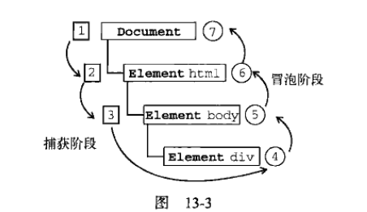

#红宝书简单的笔记之二


为什么要开个新的呢，因为我的电脑卡爆了！！啊第一个笔记完全写不下去，论写一个卡一个的感受


## 第十章 DOM

childNodes是一种比较方便的方式访问节点

ownerDocument不需要层层回溯，而是可以直接访问文档节点


documnet取得的是索引


索引

我们所使用的方括号语法，在后台的处理过程中，对数值的索引就会调用item()，对字符串的索引就会调用namedItem()


元素的子节点

```html
<ul>
	<li></li>
	<li></li>
	<li></li>
</ul>
```

这个在非IE中会被解释为7个节点（包括li之间的空白符）


documentfragment，是一种轻量级的文档，不能控制和操作，但可以保存一些可能要添加进文档中的节点

文档树和文档片段不可等同，appendchild也只是将文档片段的子节点添加了进去，文档片段本身永远不会成为文档树的一部分

```javascript
var fragment = document.createDocumentFragment();
var ul = document.getElementById("myList");
var li = null;

for(var i = 0; i < 3; i++){
    li = document.createElement("li");
    li.appendChild(document.createTextNode("Item" + (i+1)));
    fragment.appendChild(li);
}
ul.appendChild(fragment);
```

可以一次添加防止反复渲染


loadStyles()

加载外部样式文件的过程是异步的，也就是加载样式与执行js代码的过程没有固定的次序


**动态**

NodeList NamedNodeMap  HTMLCollection

这三个集合都是动态的，也就是每当文档结构发生变化的时候，它们都会得到更新

这会造成一些很有趣的问题

比如说

```javascript
for(i = 0; i < divs.length; i++){
    div = docunment.createElement("div");
    document.body.appendChild(div);
}
```

在这里你会发现，每循环一次就会插入一个新的元素，那么length的数量就会加一，这个循环永远停不下来

使用一个变量记录下这个length，一方面可以避免这种类似的情况，另一方面，也可以减少访问的次数，因为每一次访问都会运行一次基于文档的查询

DOM关键处在于理解DOM对性能的影响，因为这往往是js中开销最大的部分，要尽可能减少DOM操作

##第十一章 DOM扩展

滚动：scrollIntoView（）


## 第十三章 事件处理


###事件冒泡



三个阶段：

1.事件捕获阶段  从document到html到body

2.处于目标阶段

3.事件冒泡阶段


阻止事件冒泡主要就是处理阶段三，比如说一个表单，一个表单中的按钮，表单本身有一个点击事件，而点击按钮以后也有一个点击事件。当用户点击按钮的时候，按钮的事件被触发，随后在冒泡阶段触发了表单的点击事件


### 事件委托

事件处理程序过多

利用事件冒泡，只指定一个事件处理程序，就可以管理某一类型的所有事件

方案：在DOM中尽量最高的层次上添加事件处理程序


## 第十四章 表单脚本


onclick和submit事件的顺序

添加了require字段，提交表单的时候不能为空

###表单的序列化

type+name+value

